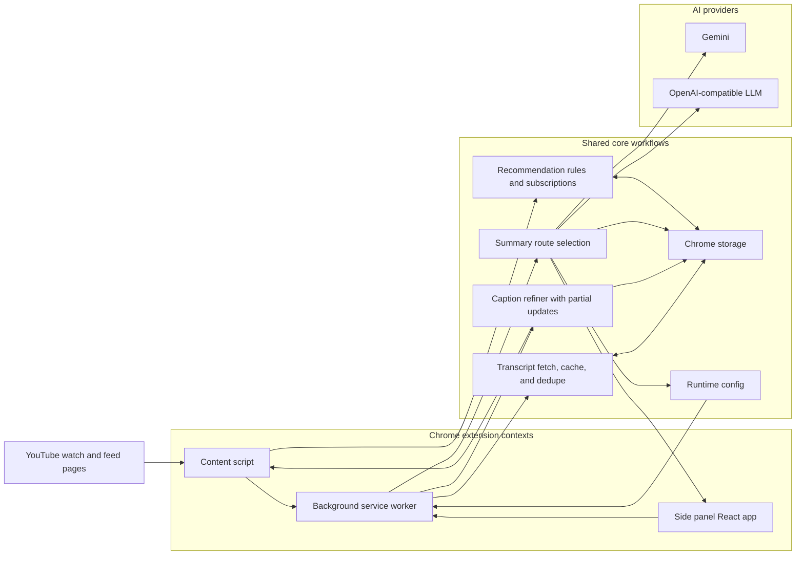
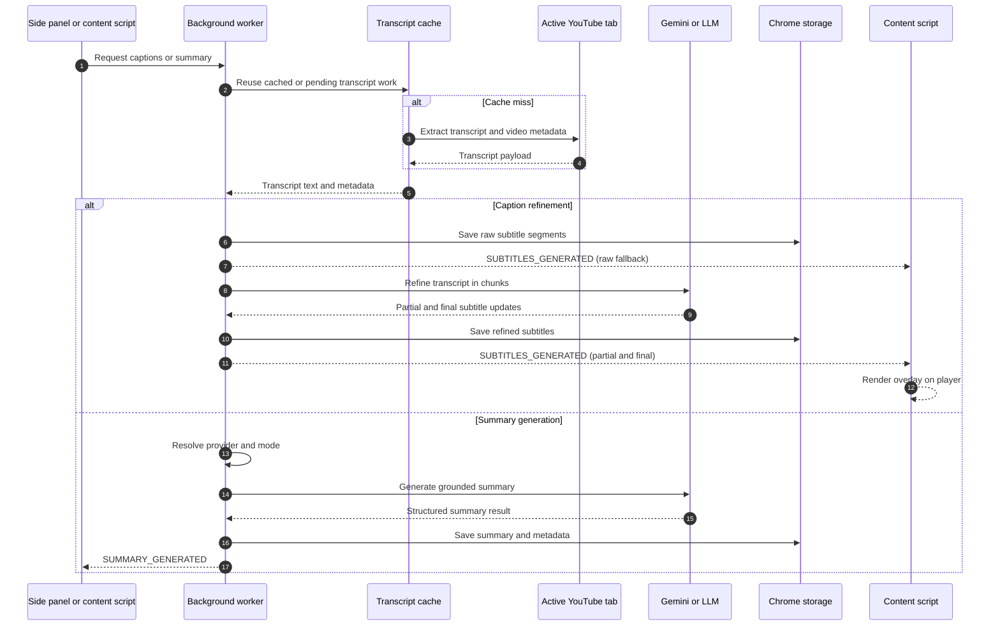
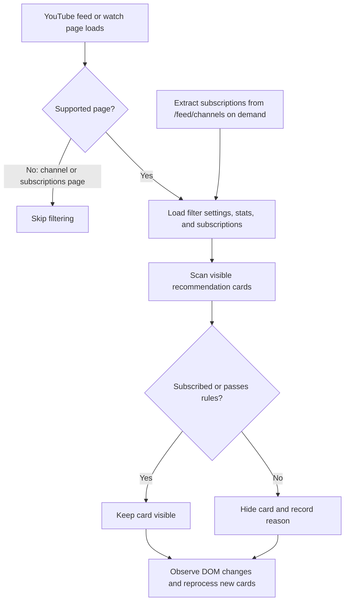

# Better YouTube

Chrome MV3 extension for YouTube transcript extraction, caption refinement, grounded AI summaries, and recommendation filtering.


[Static Demo](https://teron131.github.io/better-youtube)

## What It Does

- Extracts transcript and video metadata from the active YouTube watch tab.
- Refines subtitle segments in the background and streams partial caption updates back to the player.
- Generates video summaries with Gemini or an OpenAI-compatible LLM route.
- Caches transcripts, subtitles, metadata, and summaries in extension storage to avoid repeated work.
- Filters recommendation feeds with saved rules such as views, duration, age, keywords, and subscription preservation.

## Architecture



## Processing Flows



## Recommendation Filtering



## Runtime Design

- `public/manifest.json` wires the MV3 service worker, content script, side panel, and permissions.
- `src/handlers/index.ts` is the background entrypoint and routes `MESSAGE_ACTIONS` requests.
- `src/content/index.ts` manages YouTube SPA navigation, subtitle rendering, and auto-generation triggers.
- `src/sidepanel/main.tsx` boots the React side panel used in both extension and demo mode.
- `src/core/*` contains shared contracts, transcript logic, refiner logic, summarizer logic, storage helpers, and runtime config.

## Key Behaviors

- Transcript fetches are cached and deduplicated before caption or summary work begins.
- Caption refinement first saves raw subtitle segments, then pushes partial refined results as they become available.
- Summary generation selects a provider and mode from runtime config, model choice, and available API keys.
- Long-running work is guarded by `requestId` and per-video workload tracking so stale responses are ignored.
- Storage keys and cross-context actions are centralized in `src/core/constants.ts`.

## Development

```bash
npm install
npm run dev
npm run build
```

Useful extra commands:

```bash
npm run lint
npm run test:chrome-tab
```

## Load The Extension

1. Run `npm run build`.
2. Open `chrome://extensions`.
3. Enable `Developer mode`.
4. Click `Load unpacked`.
5. Select the repo's `dist/` directory.

## Build Output

`npm run build` produces:

- `dist/sidepanel.html` and the React side panel bundle
- `dist/background.js` for the MV3 service worker
- `dist/content.js` and `dist/assets/subtitles.css` for the YouTube page integration
