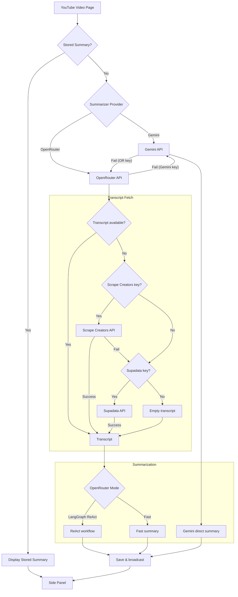

# Better YouTube Chrome Extension

Chrome extension combining YouTube caption refinement and AI-powered summarization.


**Static Demo**: https://teron131.github.io/better-youtube

**The Challenge**: YouTube's caption API has strict access limitations. While Gemini provides native YouTube access (in preview), it lacks robustness across varying video lengths and does not capture word-level caption details effectively.

## Workflow



## Tech Stack

- **UI**: React 18 + TypeScript + Tailwind CSS + shadcn/ui
- **Summarizer**: LangChain + LangGraph with OpenRouter
- **Build**: Vite with multi-entry points
- **Extension**: Chrome Manifest V3

## Key Components

### Side Panel (React)

- `MainView` - Caption/Summary generation UI
- `SettingsView` - API keys, model selection, display settings

### Background Script

- Message routing between side panel and content script
- LLM API calls (OpenRouter)
- Transcript fetching (Scrape Creators API)

### Content Script

- Caption overlay on YouTube video player
- URL change detection for SPA navigation
- Font size and visibility control

## External APIs

- **Scrape Creators API** - Primary YouTube transcript fetching
- **Supadata API** - Fallback transcript fetching
- **OpenRouter** - LLM access (Grok, Gemini, etc.)

## Chrome Storage Keys

| Key                    | Type    | Description                     |
| ---------------------- | ------- | ------------------------------- |
| `scrapeCreatorsApiKey` | string  | Scrape Creators API key         |
| `openRouterApiKey`     | string  | OpenRouter API key              |
| `summarizerModel`      | string  | Model for summary               |
| `refinerModel`         | string  | Model for refinement            |
| `targetLanguage`       | string  | Target language (auto/en/zh-TW) |
| `captionFontSize`      | S/M/L   | Caption overlay font size       |
| `summaryFontSize`      | S/M/L   | Summary display font size       |
| `autoGenerate`         | boolean | Auto-generate on video load     |
| `showSubtitles`        | boolean | Show caption overlay            |

## Development

```bash
npm install          # Install dependencies
npm run dev          # Dev server (side panel only)
npm run build        # Build extension
```

## Build Output

The Vite build outputs to `dist/`:

- `sidepanel.html` + React bundle
- `background.js` (service worker)
- `content.js` + `assets/subtitles.css` (content script)
