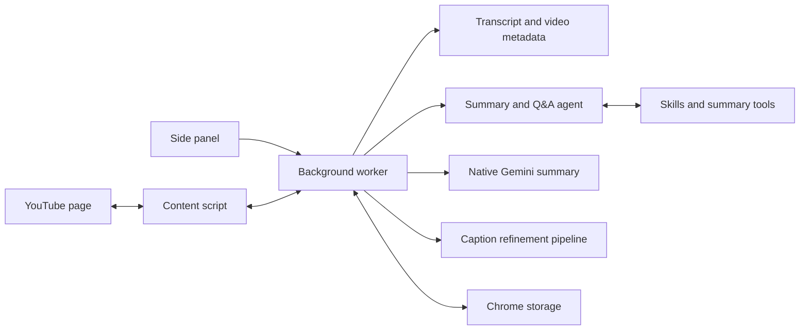
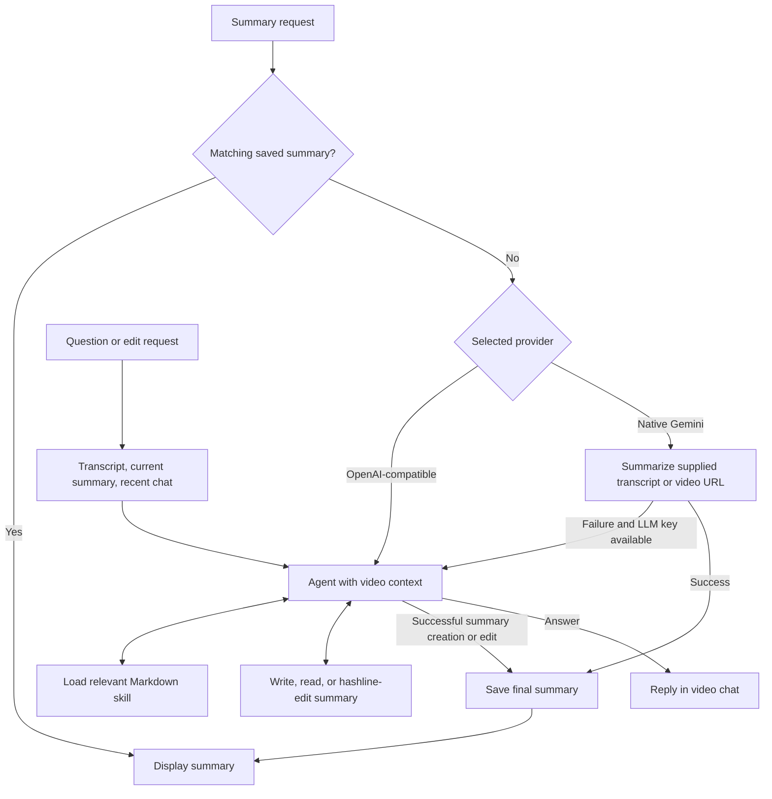
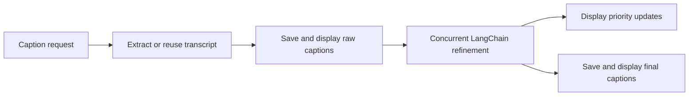
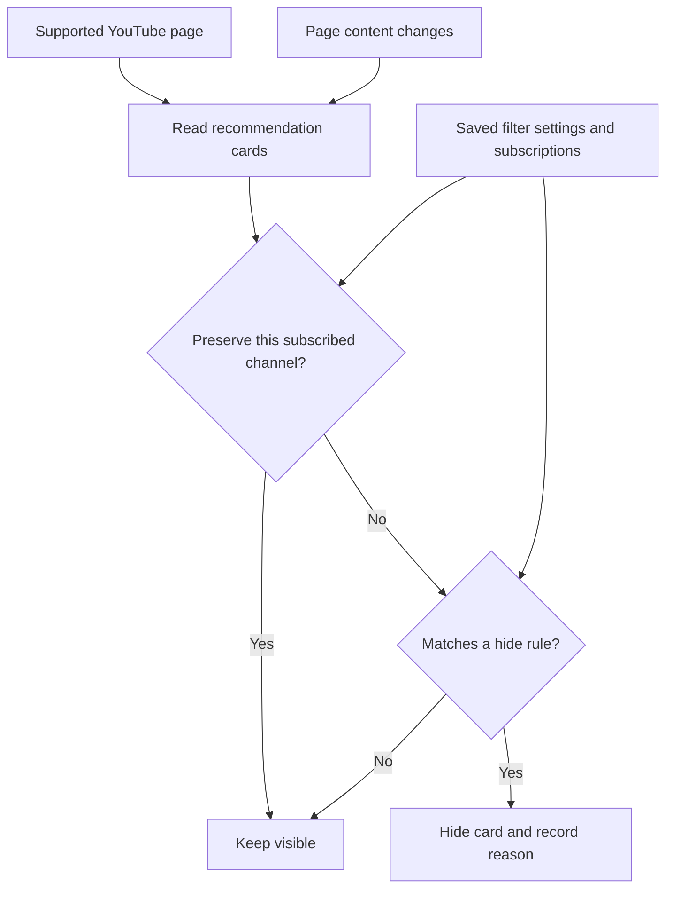

# Better YouTube

Chrome MV3 extension for YouTube transcript extraction, caption refinement, grounded AI summaries, and recommendation filtering.


<p align="center">
  
  
</p>
<p align="center">
  
  
</p>

## What It Does

- Extracts transcript and video metadata from the active YouTube watch tab.
- Refines subtitle segments in the background and streams partial caption updates back to the player.
- Generates video summaries with Gemini or an OpenAI-compatible provider.
- Uses an OpenAI Agents SDK video assistant for OpenAI-compatible summaries, follow-up questions, and summary edits.
- Caches transcripts, subtitles, metadata, and summaries in Chrome storage.
- Filters recommendation feeds with saved rules such as views, duration, age, keywords, and subscription preservation.

## Transcript Sources

The extension reads captions and metadata from the active YouTube tab and reuses cached transcripts when available.
Native Gemini summaries can also use the video URL directly.
Follow-up chat requires a transcript and a configured OpenAI-compatible API key.

## How It Works



### Summaries and Q&A

The agent reads the video context, loads Markdown skills, and can inspect and edit an in-memory summary using hashline tools.
Only successful runs save summary changes; temporary tool history is discarded.



### Caption Refinement

Caption refinement runs independently of the agent and processes transcript chunks concurrently.



### Recommendation Filtering



## Development

```bash
pnpm install
pnpm run dev
pnpm run build
```

Useful extra commands:

```bash
pnpm run lint
pnpm run test:chrome-tab
```

For a layout preview, run `pnpm dev` and open `/sidepanel.html?example=1`.
Real video processing requires the installed extension and a configured API key.

## Load The Extension

1. Run `pnpm run build`.
2. Open `chrome://extensions`.
3. Enable `Developer mode`.
4. Click `Load unpacked`.
5. Select the repo's `dist/` directory.

## Build Output

`pnpm run build` produces:

- `dist/sidepanel.html` and the React side panel bundle
- `dist/background.js` for the MV3 service worker
- `dist/content.js` and `dist/assets/subtitles.css` for the YouTube page integration
