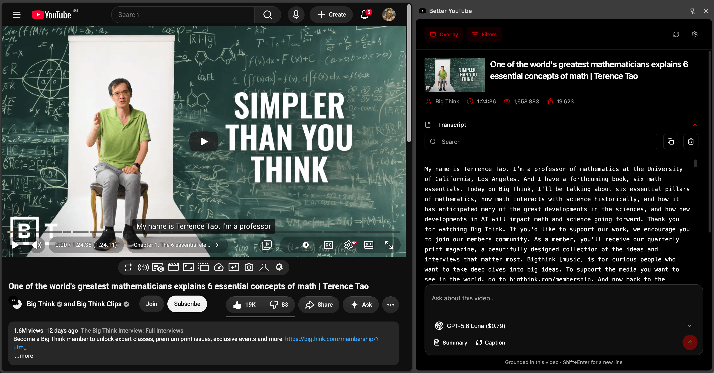
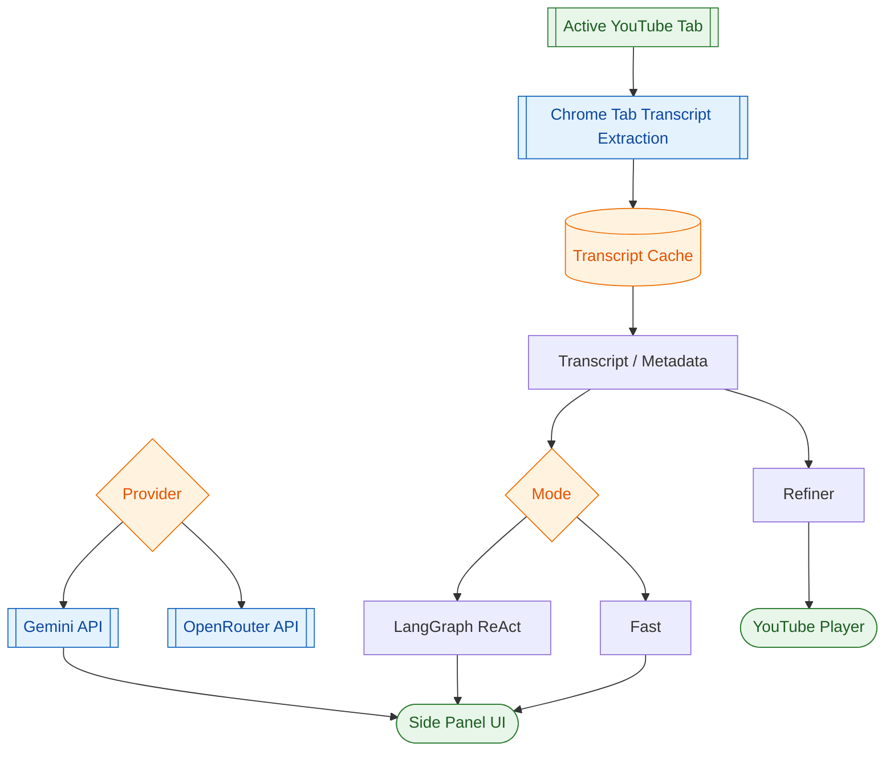

# Better YouTube Chrome Extension

Chrome extension combining YouTube caption refinement and AI-powered summarization.



**Static Demo**: https://teron131.github.io/better-youtube

## Workflow



## Transcript Source

- The extension extracts caption tracks and metadata from the active YouTube watch tab using Chrome's tab/script APIs.
- Transcript fetches are cached and deduplicated in the background worker before refinement or summarization runs.

## Workflow Management

- Every long-running summary/caption request carries a `requestId` and responses are matched by `{ action, videoId, requestId }`.
- Service worker orchestration uses per-video workload keys and in-flight job maps to dedupe identical concurrent work.
- Latest workload wins per video: stale results/errors from older workloads are suppressed.
- Content script applies a stale guard for captions and ignores subtitle updates that do not match the current caption request ID.
- Summary UI listener resolves only the matching request ID and ignores broadcasts from other runs.

## Development

```bash
npm install          # Install dependencies
npm run dev          # Dev server (side panel only)
npm run build        # Build extension
```

## Build Output

`npm run build` outputs the extension package to `dist/`:

- `sidepanel.html` + React bundle
- `background.js` (service worker)
- `content.js` + `assets/subtitles.css` (content script)
